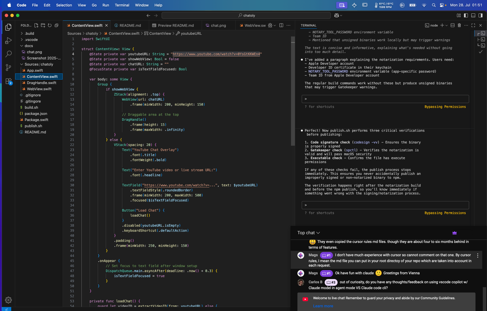

# Chatoly

A simple macOS YouTube chat overlay application that displays YouTube live stream chat in an always-on-top window.

[](https://mariozechner.at/uploads/chatoly-demo.mp4)
*Click the image above to watch the demo video*

*<sub>Watch this thing get built from scratch in [2 hours](https://www.youtube.com/watch?v=0YsGtKKWEn4)</sub>*

## Installation

```bash
npm install -g @mariozechner/chatoly
chatoly
```

## Features

- **Always on top** - Chat window stays above all other applications
- **Movable & Resizable** - Position and size the chat window exactly where you need it
- **YouTube live stream chat** - Works with any YouTube live stream or video with chat

## Development

```bash
# Clean build artifacts
./build.sh clean

# Build and run
./build.sh run

# Build release and run
./build.sh release run

# Build for distribution (signs and notarizes)
./build.sh notarize
```

For notarization to work, you need an Apple Developer account with a valid Developer ID certificate. Set the `NOTARY_TOOL_PASSWORD` environment variable with an app-specific password generated from your Apple ID account. The build script expects your certificate to be named "Developer ID Application" in your keychain. You'll also need your Team ID from your Apple Developer account. Without these, use the regular build commands which produce unsigned binaries that work locally but may trigger Gatekeeper warnings when shared.

### Requirements

- macOS 13.0+
- Swift 6.0+